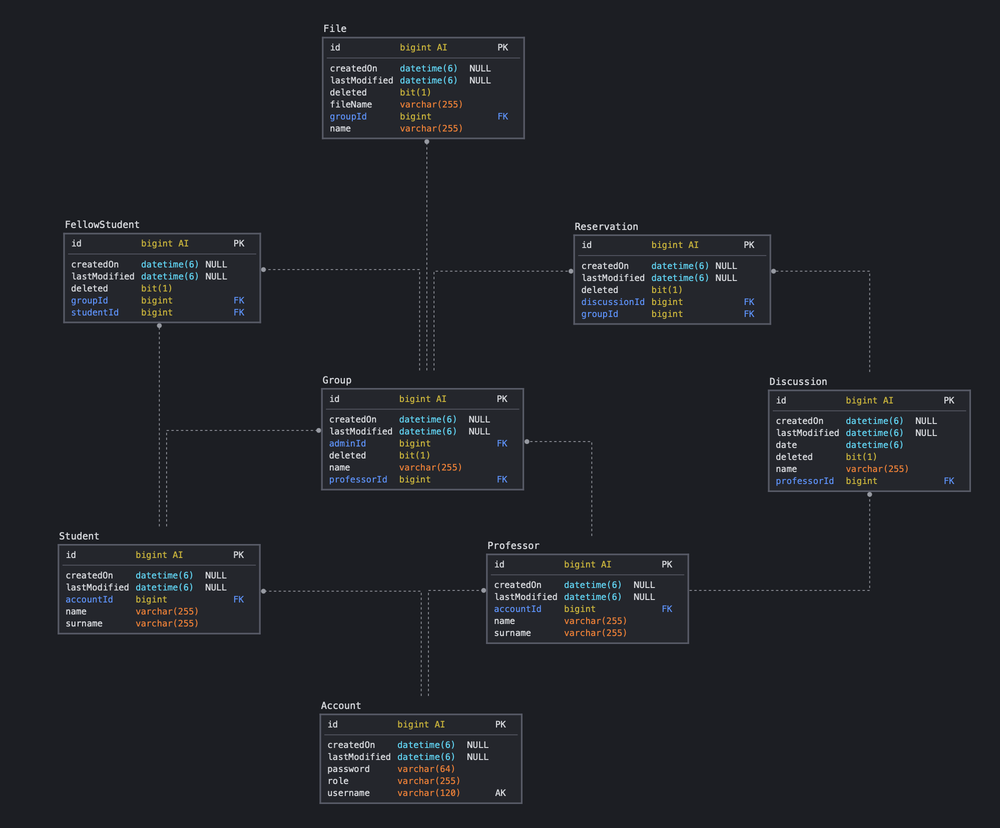

# Project for Polimi

### Documentation

The project documentation can be read at the following link: [Documentation](https://app.swaggerhub.com/apis/Luke505/polimi-api/1.0.0)

### Requirements

The application requires:
* Database (see Configuration for more information)
* Mail server (by default it sends emails without authentication, then all emails will arrive in the spam folder)

### Database (self-generated)

### Configuration

The configuration is available in /src/main/resources/application.properties

The most important configurations are:
* Server Port
    >   server.port
* Database
    >   spring.datasource.url \
        spring.datasource.username \
        spring.datasource.password \
        spring.datasource.driver-class-name
* Encryption key
    >   jwt.secret
* Upload directory
    >   file.upload-dir

### Testing

The tests are available in /src/test/java divided into:

* Controllers:
    * Test public end points
    * Test student end points
    * Test professor end points
* Service:
    * Test public operation
    * Test student operation
    * Test professor operation
